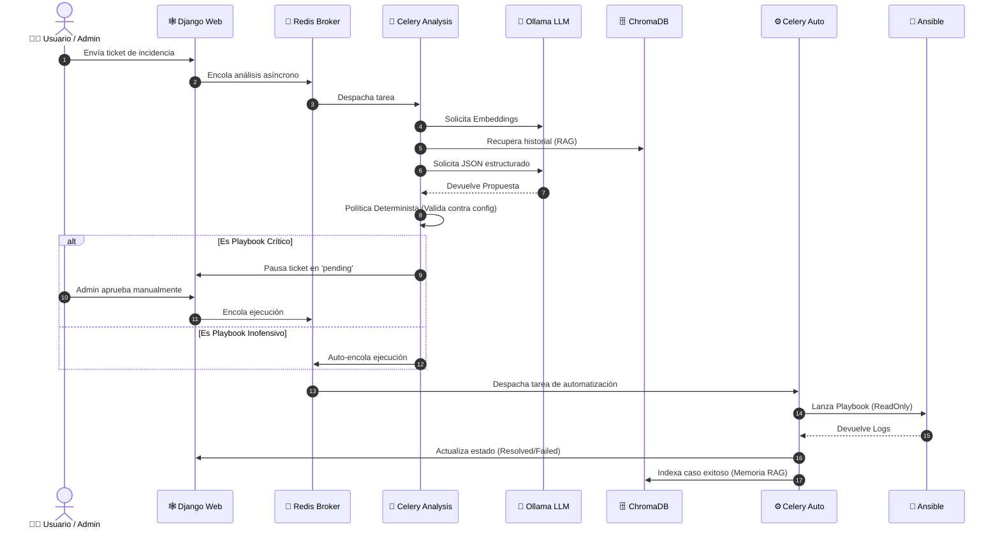

# AI-Driven DevOps Ticketing Assistant 🚀

Plataforma de gestión de incidencias con Django, Celery, Ollama, ChromaDB y Ansible. La IA clasifica y propone acciones; una política determinista valida el playbook, el destino y el servicio antes de cualquier ejecución.

> **⚠️ Estado:** base corregida para laboratorio y desarrollo. No debe desplegarse en producción sin completar la sección de seguridad.

---

## 🔒 Principio de Seguridad y Arquitectura (Zero-Trust)

El sistema ha sido rediseñado bajo un principio estricto: **La IA recomienda, pero la política y los permisos autorizan.**



La IA no proporciona comandos, rutas, IP arbitrarias, patrones de inventario ni nombres de servicio libres. Trabaja con identificadores lógicos autorizados por el backend.

---

## 🧩 Componentes del Sistema

- **🕸️ Django:** portal, permisos, modelo y administración.
- **🐘 PostgreSQL:** persistencia transaccional.
- **🔴 Redis:** broker y resultados de Celery.
- **🧠 Celery Analysis:** embeddings, RAG y clasificación.
- **🤖 Ollama:** inferencia local estructurada.
- **🗄️ ChromaDB:** memoria vectorial.
- **⚙️ Celery Automation:** worker aislado para Ansible.
- **🚀 Ansible Runner:** playbooks autorizados.
- **🔐 LDAP/AD:** autenticación corporativa opcional.

---

## 🛠️ Estructura del Proyecto

```text
.
├── .env.example
├── .gitignore
├── .dockerignore
├── compose.yaml
├── playbooks/project
│   ├── ping.yml
│   └── restart_service.yml
└── web
    ├── Dockerfile
    ├── manage.py
    ├── requirements.txt
    ├── portal
    ├── templates
    └── tickets
```

---

## ⚙️ Configuración Inicial

### 1. Crear `.env`

```powershell
Copy-Item .env.example .env
notepad .env
```

Configure como mínimo:

```dotenv
SECRET_KEY=CHANGE_ME_WITH_A_LONG_RANDOM_VALUE
DB_PASSWORD=CHANGE_ME
```

### 2. Primera prueba sin LDAP (Laboratorio)

```dotenv
LDAP_SERVER=
LDAP_BIND_DN=
LDAP_BIND_PW=
LDAP_BASE=
LDAP_ADMIN_GROUP_DN=
```

### 3. Política de laboratorio

```dotenv
ALLOWED_TARGETS_JSON={"local-lab":"127.0.0.1"}
ALLOWED_SERVICES_JSON={"web":"nginx"}
```

> 💡 `local-lab` y `web` son identificadores lógicos. Solo el backend conoce sus valores reales.

---

## 🚀 Despliegue de Laboratorio

```powershell
docker compose build
docker compose up -d db redis chroma ollama
docker compose exec ollama ollama pull llama3.1:8b
docker compose exec ollama ollama pull nomic-embed-text
docker compose up -d
docker compose run --rm web python manage.py collectstatic --noinput
docker compose exec web python manage.py createsuperuser
```

**Accesos:**
- 🌐 **Portal:** http://localhost:8000/
- 🛡️ **Administración:** http://localhost:8000/admin/
- 🩺 **Salud:** http://localhost:8000/health/

---

## 🚦 Estados del Ticket

| Estado | Descripción |
| :--- | :--- |
| 🟢 `open` | Pendiente de análisis |
| 🔍 `analyzing` | Análisis de IA en curso |
| ⚠️ `pending` | Acción crítica pendiente de aprobación (HITL) |
| ⏳ `queued` | Ejecución encolada en Redis |
| ⚙️ `running` | Automatización en curso |
| ✅ `resolved` | Resuelto con éxito |
| ❌ `failed` | Fallido |
| 🚫 `rejected` | Rechazado por política o administrador |

---

## 🛡️ Seguridad antes de producción (Checklist)

- [ ] 🔒 HTTPS mediante proxy inverso.
- [ ] 🔑 Secretos gestionados mediante Vault, Docker Secrets o Kubernetes Secrets.
- [ ] 📜 CA corporativa validada para LDAPS.
- [ ] 📱 MFA implementado para administradores.
- [ ] 💻 Identidad SSH y `known_hosts` estrictos para Ansible.
- [ ] 🛑 `sudoers` limitado por servicio (sin `sudo ALL` ni `su`).
- [ ] 📊 Rate limiting y cuotas en la API / Web.
- [ ] 🧪 Suite de pruebas unitarias, integración y seguridad.
- [ ] 🐳 SAST, análisis de dependencias y escaneo de imágenes de contenedores.
- [ ] 💾 Backups programados de PostgreSQL y ChromaDB.
- [ ] 🗑️ Política de retención y expurgo de datos vectoriales.
