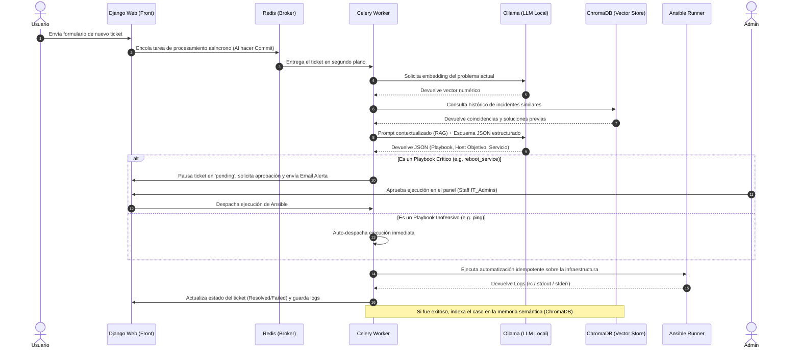

# AI-Driven DevOps Ticketing Assistant 🚀

Plataforma empresarial automatizada para la gestión, análisis y remediación automatizada de incidencias en infraestructuras de sistemas. Combina un portal web de control en Django con un motor de Inteligencia Artificial (IA) local (RAG) y automatización mediante Ansible, integrando un estricto control de seguridad humana para la ejecución de acciones críticas.

Este proyecto fue desarrollado originalmente por **Jose Antonio Muñoz Galera** como entrega para el ciclo de 2º de ASIR en el **I.E.S. Zaidín-Vergeles (Granada)**, y ha sido expandido con capacidades avanzadas de resiliencia, seguridad y control de ejecución.

---

## 🏗️ Arquitectura del Sistema

El ecosistema está completamente contenerizado bajo una arquitectura de microservicios distribuidos, altamente desacoplados mediante colas de eventos asíncronas y protegidos por segmentación de red:



---

## 🛠️ Tecnologías Utilizadas

* **Core Framework:** Django 5.0 (Gestión de portal, ORM avanzado y panel de administración).
* **Asynchronous Engine:** Celery & Redis (Procesamiento asíncrono y distribución de tareas pesadas en segundo plano).
* **Relational Database:** PostgreSQL 15 (Persistencia transaccional de producción con alta concurrencia).
* **Local AI Engine:** Ollama (Inferencia local y estructurada del modelo `llama3:latest` y embeddings con `nomic-embed-text`).
* **Vector Store:** ChromaDB 0.4.24 (Memoria semántica, indexación e inyección de contexto RAG).
* **Infrastructure as Code (IaC):** Ansible & Ansible Runner (Ejecución controlada de playbooks de automatización estructurados).
* **Enterprise Auth:** Django-Auth-LDAP (Autenticación e integración híbrida con Controladores de Dominio Samba 4 / Active Directory).

---

## 🌟 Nuevas Implementaciones y Mejoras Avanzadas

El sistema ha sido robustecido con las siguientes arquitecturas y buenas prácticas de desarrollo y DevOps:

### 1. Control "Human-in-the-Loop" (HITL) para Acciones Críticas
Para evitar que la IA tome decisiones destructivas de forma autónoma, se ha implementado un sistema de retención de acciones. Los playbooks se clasifican en listas de criticidad:
* **Playbooks Inofensivos (`ping`):** Se ejecutan de manera inmediata y automatizada.
* **Playbooks Críticos (`reboot_service`):** Detienen el flujo del ticket, cambiándolo al nuevo estado **`Pendiente de Aprobación` (pending)**. Se dispara un correo electrónico automático de alerta al administrador (`ADMIN_EMAIL`) y el playbook queda bloqueado hasta que un usuario con privilegios de administrador (**Staff / IT_Admins**) valide y autorice la ejecución manualmente desde la interfaz web.

### 2. Inferencia Estructurada con Validación de Esquema estricto (JSON Mode)
Se ha migrado la interacción con el SDK de Ollama hacia un modelo de **salida estructurada basada en esquemas JSON**. Esto obliga al modelo local (`llama3`) a responder con una estructura predecible que mapea exactamente los campos requeridos (`playbook`, `target_host`, `service_name`), aplicando una validación tipo `enum` basada en los playbooks permitidos por ingeniería. Esto elimina las alucinaciones conversacionales de texto plano y mitiga ataques de *Prompt Injection*.

### 3. Mitigación de Condiciones de Carrera mediante Transacciones de BD
En el módulo de vistas (`views.py`), el lanzamiento de la tarea de Celery (`analizar_ticket.delay`) se ha envuelto dentro del método hook **`transaction.on_commit()`**. Esto garantiza que la tarea asíncrona no se envíe a Redis hasta que Django haya consolidado y guardado físicamente de forma exitosa el registro del ticket en PostgreSQL, evitando errores donde el Worker intenta leer un ID de ticket que aún no existe debido a la latencia de la base de datos.

### 4. Ciclo de Vida Inmutable y Servicio Desacoplado de Migraciones (`db-migrator`)
Se ha reestructurado el archivo `docker-compose.yml` eliminando la ejecución aleatoria de comandos de migración dentro del contenedor web, lo cual generaba condiciones de carrera al escalar réplicas. Se ha introducido un contenedor especializado **`db-migrator`** que aplica de forma aislada e idempotente las migraciones de PostgreSQL. Tanto el servidor `web` como los `celery_worker` esperan a que este contenedor complete su tarea con éxito (`service_completed_successfully`) antes de iniciar sus servicios.

### 5. Aislamiento Estricto de Redes (Zero-Trust Containers)
La infraestructura se ha segmentado en tres redes Docker aisladas para limitar el radio de explosión ante vulnerabilidades:
* `frontend-nw`: Red orientada al exterior, única con puertos expuestos al host (puerto `8000` de Django).
* `backend-nw`: Red de datos privada. Conecta a Django, Celery, PostgreSQL y Redis. Ningún componente externo puede verla.
* `ai-nw`: Red privada para el ecosistema de IA. Conecta exclusivamente a Celery con Ollama y ChromaDB, aislando los modelos y vectores del servidor web expuesto a internet.

### 6. Paginación de Rendimiento en la Interfaz
El listado de visualización de tickets en el portal ha sido optimizado utilizando el componente `Paginator` de Django, limitando la carga a un máximo de **10 tickets por página** para salvaguardar el rendimiento del renderizado en navegadores y disminuir la sobrecarga de consultas al ORM.

---

## 📦 Instrucciones de Despliegue

### Configuración de Variables de Entorno
Copia el archivo de ejemplo:
```bash
cp .env.example .env
```
Edita el archivo `.env` configurando los accesos a tu infraestructura:
* **Active Directory (Samba 4):** Ajusta las credenciales de `LDAP_BIND_DN` y la base de búsqueda `LDAP_BASE`. Los usuarios del grupo `cn=IT_Admins,cn=Users,...` obtendrán automáticamente rango de administradores en el portal.
* **Servidor SMTP:** Configura tu token de aplicación para el envío automatizado de alertas HITL.
* **Infraestructura de IA:** Los servicios apuntan de manera nativa a los nombres de contenedor internos gracias a la resolución DNS de Docker (`http://ollama:11434` y `http://chroma:8000`).

### Levantamiento Unificado
Para compilar las imágenes e iniciar la plataforma completa en segundo plano, ejecuta:
```bash
docker compose up --build -d
```

El portal web estará disponible inmediatamente en `http://localhost:8000`. Puede monitorizar las tareas asíncronas de la IA y Ansible inspeccionando los logs del contenedor de Celery:
```bash
docker logs -f ticketing-celery
```