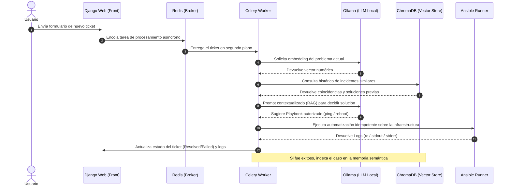

# AI-Driven DevOps Ticketing Assistant 🚀[cite: 1]

Plataforma automatizada para la gestión y resolución de tickets de incidencias de sistemas. El sistema combina un entorno web de control con un motor de Inteligencia Artificial (IA) local para el análisis de texto y la recomendación/ejecución automatizada de soluciones de infraestructura de forma segura.

Este proyecto fue desarrollado originalmente por Jose Antonio Muñoz Galera como entrega para el ciclo de 2º de ASIR en el I.E.S. Zaidín-Vergeles (Granada).

---

## 🏗️ Arquitectura del Sistema

El proyecto está completamente contenerizado bajo una arquitectura de microservicios distribuidos y desacoplados mediante colas de eventos:



---

## 🛠️ Tecnologías Utilizadas

* **Core Framework:** Django 5.0 (Gestión de portal, ORM y panel de administración).
* **Asynchronous Engine:** Celery & Redis (Procesamiento de tareas pesadas en segundo plano sin bloquear la UI).
* **Relational Database:** PostgreSQL (Persistencia de datos de nivel de producción con alta concurrencia).
* **Local AI Engine:** Ollama (Inferencia local del modelo `llama3:latest` y embeddings con `nomic-embed-text`).
* **Vector Store:** ChromaDB (Memoria semántica e indexación para técnicas RAG).
* **Infrastructure as Code (IaC):** Ansible & Ansible Runner (Ejecución controlada de playbooks de automatización).
* **Enterprise Auth:** Django-Auth-LDAP (Integración híbrida con Controladores de Dominio Samba 4 / Active Directory).

---

## 🚀 Características Destacadas

1. **Desacoplamiento Radical:** Las peticiones de los usuarios se resuelven de inmediato. Las tareas pesadas de IA y ejecución de scripts se delegan a workers asíncronos distribuidos.
2. **Flujo RAG Local Terminado:** El sistema extrae el contexto del problema, busca incidentes idénticos en el histórico vectorial y alimenta el prompt del LLM para evitar alucinaciones y repetir soluciones exitosas pasadas.
3. **Mitigación de Riesgos (Lista Blanca):** El LLM está estrictamente restringido a nivel de código para seleccionar únicamente playbooks verificados por el equipo de ingeniería (`ping`, `reboot_service`), evitando ejecuciones arbitrarias de comandos dañinos.
4. **Persistencia Enterprise:** Migrado de SQLite a PostgreSQL para garantizar la resiliencia en lecturas y escrituras concurrentes de los workers.
5. **Optimización Edge Computing:** Diseñado para ejecutarse eficientemente bajo entornos con restricciones de hardware, optimizando los timeouts y la concurrencia de procesos en dispositivos como la Raspberry Pi 5.

---

## 📦 Instrucciones de Despliegue Rápido

### Requisitos Previos
* Tener instalado **Docker** y **Docker Compose**.

### Configuración del Entorno
1. Clona este repositorio en tu máquina local.
2. Copia el archivo de ejemplo de variables de entorno y renómbralo:
   ```bash
   cp .env.example .env
   ```
3. Edita las variables del archivo `.env` introduciendo tus configuraciones del servidor LDAP (Samba 4) y las credenciales SMTP de tu servidor de correos.

### Levantamiento de la Infraestructura
Para compilar imágenes e iniciar todos los servicios del ecosistema de forma unificada, ejecuta:

```bash
docker compose up --build
```

El motor interno se encargará de aplicar de forma idempotente las migraciones de la base de datos PostgreSQL, inicializar las colecciones de ChromaDB, y arrancar tanto el servidor web de producción Gunicorn como los workers de Celery. El portal quedará accesible localmente en `http://localhost:8000`.